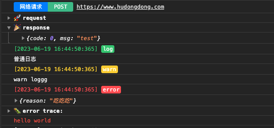

# dLog

微信小程序日志封装，根据`console`封装。基础库版本不低于`2.21.3`




## 使用

1、引入dLog

```
const dLog = require('../utils/dLog.js')
```

2、调用dLog

```
dLog.netLog("https://www.hudongdong.com", {"userID": 0}, {"code": 0, "msg": "test"})
dLog.log("普通日志")
dLog.warn("warn", "loggg")
dLog.error({"reason": "吃吃吃"})
dLog.color("hello world")
```

## 更多配置

微信支持实时日志，有助于在线查询日志，可以设置`dLog.js`文件中的`realtimeLogEnable`设置是否开启

```
const logOutput = true    //是否输出
const realtimeLogEnable = true        //开启实时日志
```